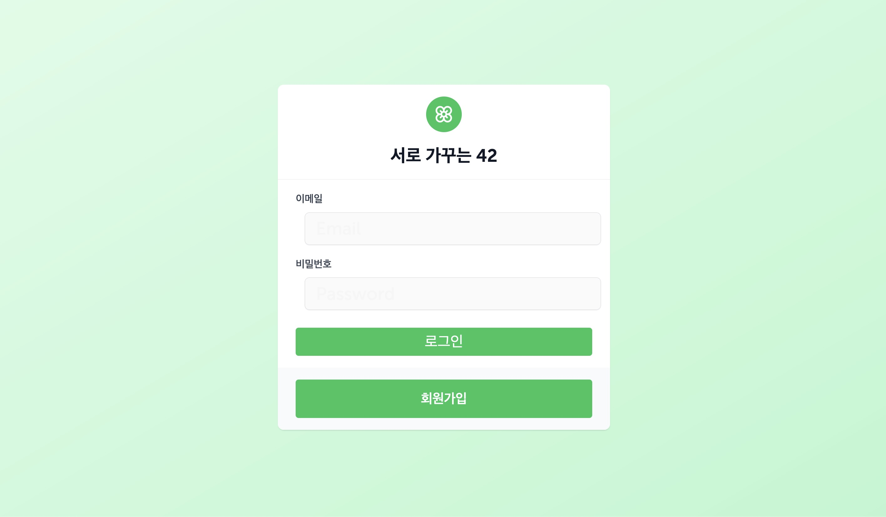
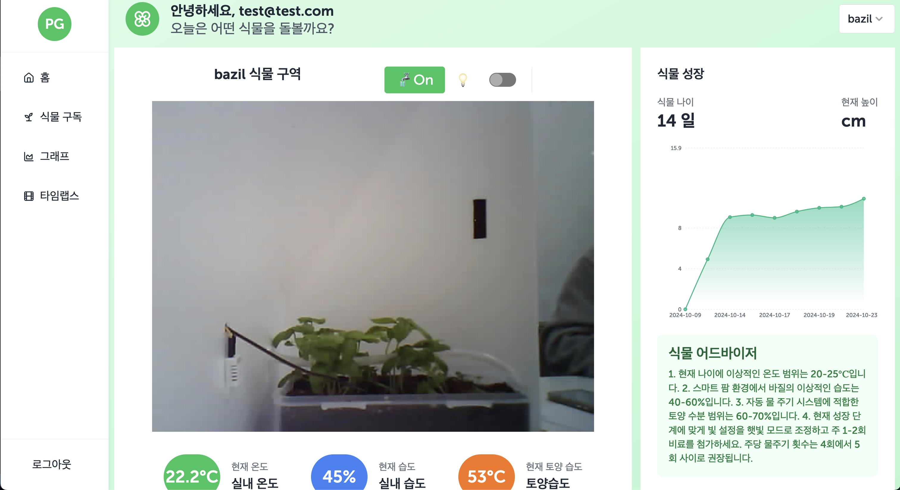
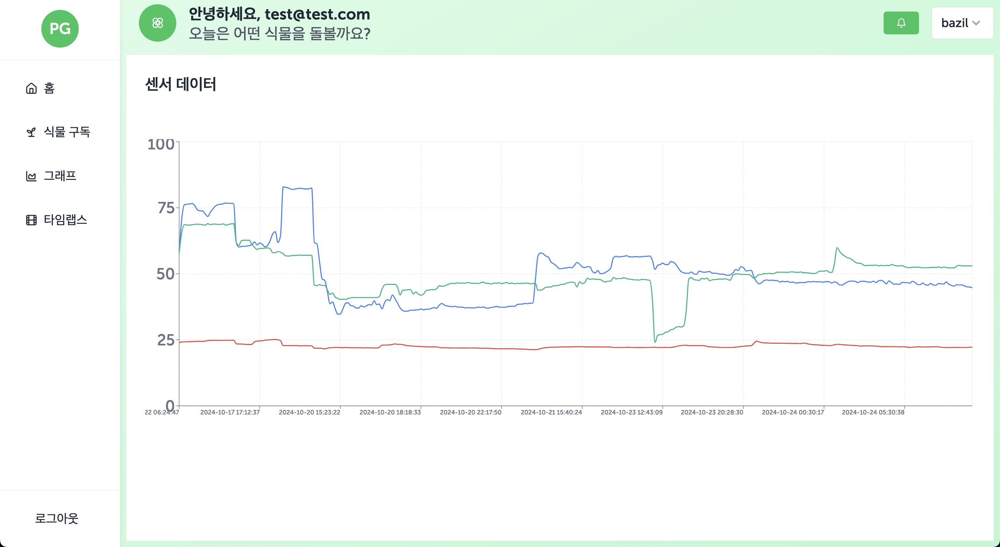
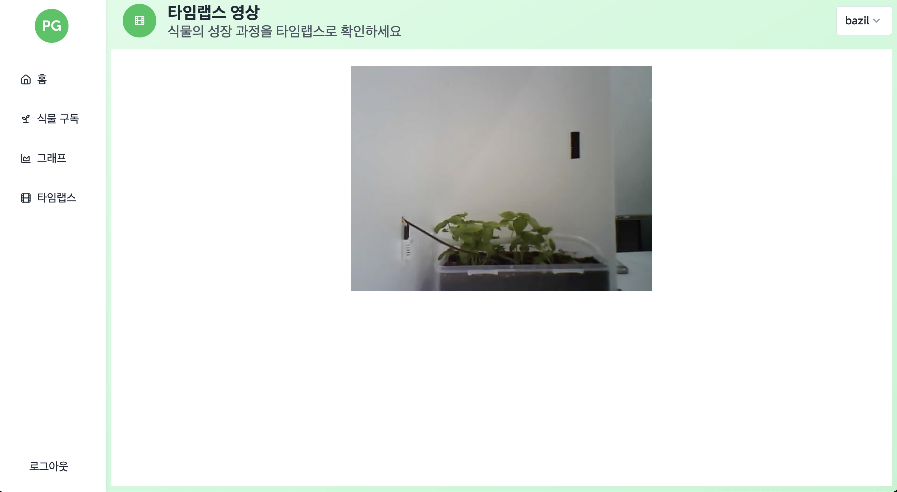
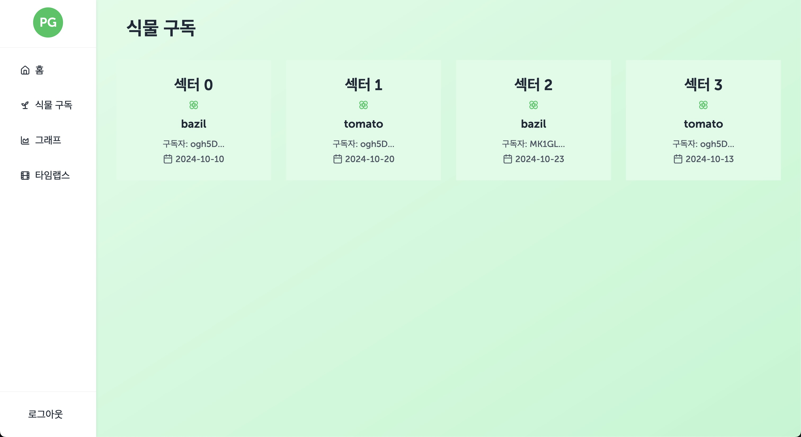
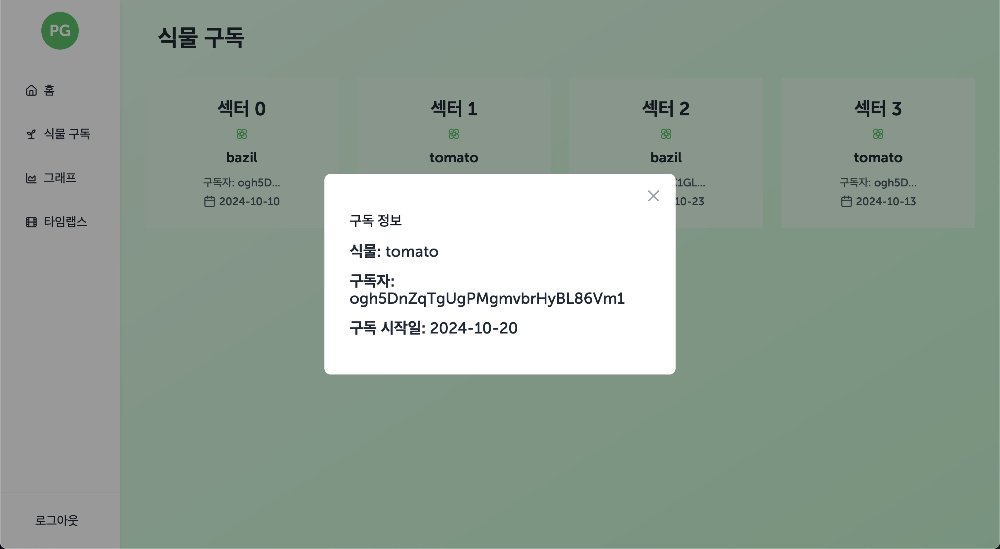

# 🌿 Client Web App 🌿
The client app provides real-time plant and sensor monitoring, along with a GPT-based plant growth advisor.  
Users can subscribe to different sectors of the smart farm.  
Additionally, the app offers a time-lapse feature that captures the plant growth process.

## 📚 Panel
- Login
  
- Dashboard
  
- Chart
  
- Time-lapse
  
- Subscribe
  
  
